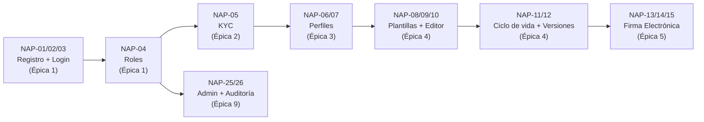

# Backlog — Sprint 01

**Proyecto:** NAP — Plataforma de gestión y creación de contratos
**Versión:** 1.0 (Basado en ERS IEEE 830 v1.1)
**Preparado por:** Fredinson Solano (CEO / Scrum Master)
**Preparado para:** Steven Quiñones (CTO) — importar a Jira

---

## Instrucciones para Steven

1. Crear proyecto en Jira con metodología Scrum.
2. Crear las épicas abajo listadas.
3. Crear cada historia como issue de tipo "Historia" dentro de su épica.
4. Asignar el `Story Points` tentativo (columna SP) — ajustar según criterio del equipo.
5. Mover al Sprint Backlog las historias marcadas como **Sprint 1**.
6. Las marcadas como **Backlog** son para sprints posteriores.

---

## Épica 1: Identidad y Acceso (Core)

> **RF-001, RF-002, RF-004, RF-007**
> Prioridad funcional: *Fundación del sistema*

| ID | Historia | Criterios de aceptación | SP | Sprint |
|---|---|---|---|---|
| NAP-01 | Como visitante, quiero registrarme como usuario individual con correo y contraseña para acceder a la plataforma. | RF-001 | 5 | Sprint 1 |
| NAP-02 | Como empresa, quiero registrarme con NIT y representante legal para gestionar contratos formales. | RF-002 | 5 | Sprint 1 |
| NAP-03 | Como usuario registrado, quiero iniciar sesión con mis credenciales para acceder al sistema (con bloqueo tras intentos fallidos). | RF-004 | 3 | Sprint 1 |
| NAP-04 | Como administrador, quiero asignar roles (cliente, profesional, empresa, admin) con permisos diferenciados para controlar el acceso a funcionalidades. | RF-007 | 5 | Sprint 1 |

---

## Épica 2: Verificación de Identidad (KYC)

> **RF-003**
> *Dependencia: NAP-01, NAP-02 (requiere tener usuario)*

| ID | Historia | Criterios de aceptación | SP | Sprint |
|---|---|---|---|---|
| NAP-05 | Como usuario, quiero cargar mis documentos de identidad para verificar mi cuenta antes de firmar contratos. | RF-003, RN-001 | 8 | Sprint 1 |

---

## Épica 3: Perfiles

> **RF-009, RF-010**
> *Dependencia: NAP-01, NAP-02*

| ID | Historia | Criterios de aceptación | SP | Sprint |
|---|---|---|---|---|
| NAP-06 | Como profesional, quiero crear y editar mi perfil con habilidades, experiencia y portafolio para que los clientes me conozcan. | RF-009 | 5 | Sprint 1 |
| NAP-07 | Como empresa, quiero mantener un perfil corporativo con información de la compañía y representantes autorizados. | RF-010 | 3 | Sprint 1 |

---

## Épica 4: Contratos Formales (B2B) — Núcleo del MVP

> **RF-025, RF-026, RF-027, RF-029, RF-032**
> *Dependencia: NAP-04, NAP-05, NAP-06, NAP-07*

| ID | Historia | Criterios de aceptación | SP | Sprint |
|---|---|---|---|---|
| NAP-08 | Como empresa, quiero seleccionar una plantilla de contrato formal de la biblioteca para iniciar un contrato. | RF-025 | 3 | Sprint 1 |
| NAP-09 | Como parte contratante, quiero editar, añadir y eliminar cláusulas sobre la plantilla para personalizar el acuerdo. | RF-026 | 8 | Sprint 1 |
| NAP-10 | Como parte contratante, quiero proponer cambios y mantener un historial de versiones para negociar el contrato. | RF-027, RN-012 | 8 | Sprint 1 |
| NAP-11 | Como sistema, quiero gestionar el ciclo de vida del contrato (borrador → revisión → aprobación → firma → vigente → terminado) para garantizar las transiciones válidas. | RF-029, RN-006 | 5 | Sprint 1 |
| NAP-12 | Como sistema, quiero almacenar contratos y anexos con control de versiones y trazabilidad para asegurar su integridad legal. | RF-032, RN-013 | 5 | Sprint 1 |

---

## Épica 5: Firma Electrónica

> **RF-033, RF-034, RF-035**
> *Dependencia: NAP-11 (requiere contrato listo para firmar)*

| ID | Historia | Criterios de aceptación | SP | Sprint |
|---|---|---|---|---|
| NAP-13 | Como firmante con KYC aprobado, quiero firmar un contrato electrónicamente (con MFA) para formalizar el acuerdo. | RF-033, RN-001, RN-010 | 8 | Sprint 1 |
| NAP-14 | Como sistema, quiero generar un sello de tiempo y hash criptográfico al firmar un documento para garantizar su integridad. | RF-034 | 5 | Sprint 1 |
| NAP-15 | Como sistema, quiero registrar la auditoría de cada firma (identidad, fecha, hora, IP) para tener trazabilidad legal. | RF-035 | 3 | Sprint 1 |

---

## Épica 6: Marketplace — Necesidades y Propuestas (C2C)

> **RF-014, RF-016, RF-018**
> *Prioridad media-alta para campaña C2C, puede iniciarse en Sprint 1 si el equipo alcanza*

| ID | Historia | Criterios de aceptación | SP | Sprint |
|---|---|---|---|---|
| NAP-16 | Como cliente, quiero publicar una necesidad con alcance, categoría, presupuesto y plazo para recibir propuestas. | RF-014 | 5 | Backlog |
| NAP-17 | Como usuario, quiero buscar necesidades o profesionales con filtros (categoría, ubicación, presupuesto, valoración) para encontrar lo que necesito. | RF-016 | 5 | Backlog |
| NAP-18 | Como profesional, quiero postularme a una necesidad enviando una propuesta con alcance, precio y plazo para ofrecer mis servicios. | RF-018 | 5 | Backlog |

---

## Épica 7: Acuerdos Informales (C2C)

> **RF-020, RF-021, RF-022, RF-024**
> *Dependencia: NAP-18*

| ID | Historia | Criterios de aceptación | SP | Sprint |
|---|---|---|---|---|
| NAP-19 | Como sistema, quiero generar automáticamente un acuerdo informal desde una plantilla simplificada al aceptarse una propuesta. | RF-020 | 3 | Backlog |
| NAP-20 | Como partes del acuerdo, quiero definir alcance, precio (monto no negativo) y plazo para registrar los términos. | RF-021, RN-014 | 3 | Backlog |
| NAP-21 | Como partes, quiero aceptar el acuerdo de forma ágil con marca de tiempo para que pase a "en curso". | RF-022 | 2 | Backlog |
| NAP-22 | Como cliente, quiero confirmar el cumplimiento del trabajo para finalizar el acuerdo y liberar el pago. | RF-024 | 3 | Backlog |

---

## Épica 8: Pagos y Custodia (Escrow)

> **RF-037, RF-038**
> *Dependencia: NAP-22 (requiere acuerdo finalizado)*

| ID | Historia | Criterios de aceptación | SP | Sprint |
|---|---|---|---|---|
| NAP-23 | Como usuario, quiero registrar un método de pago a través de la pasarela para poder realizar transacciones. | RF-037 | 5 | Backlog |
| NAP-24 | Como cliente, quiero pagar un acuerdo o contrato con procesamiento seguro (idempotente) y que los fondos queden en custodia. | RF-038, RNF-025 | 8 | Backlog |

---

## Épica 9: Administración de la Plataforma

> **RF-056, RF-059**

| ID | Historia | Criterios de aceptación | SP | Sprint |
|---|---|---|---|---|
| NAP-25 | Como administrador, quiero consultar, habilitar, suspender y eliminar cuentas de usuario para gestionar la plataforma. | RF-056, RN-011 | 5 | Sprint 1 |
| NAP-26 | Como sistema, quiero registrar en un log de auditoría cada acción relevante (autor, acción, entidad, marca de tiempo) para trazabilidad. | RF-059 | 3 | Sprint 1 |

---

## Resumen del Sprint 1

### Total historias: 15 (NAP-01 a NAP-15 + NAP-25, NAP-26)
### Story Points estimados: 79

| Épica | Historias en Sprint 1 | SP |
|---|---|---|
| Identidad y Acceso | NAP-01, NAP-02, NAP-03, NAP-04 | 18 |
| KYC | NAP-05 | 8 |
| Perfiles | NAP-06, NAP-07 | 8 |
| Contratos Formales | NAP-08, NAP-09, NAP-10, NAP-11, NAP-12 | 29 |
| Firma Electrónica | NAP-13, NAP-14, NAP-15 | 16 |
| Administración | NAP-25, NAP-26 | 8 |
| **Total** | **15** | **79** |

> Los SP son tentativos. Steven debe recalibrarlos con el equipo durante Planning.

---

## Orden de implementación sugerido (dependencias)

---

## Referencias

| Documento | Relación |
|---|---|
| `ERS_NAP_IEEE830.md` (sección 3.2) | Todos los RF y criterios de aceptación |
| `ERS_NAP_IEEE830.md` (sección 4.4) | Diagramas de estados (contrato formal, acuerdo informal, pago, disputa) |
| `ERS_NAP_IEEE830.md` (sección 3.8) | Criterios de aceptación formales (Dado/Cuando/Entonces) |
| `ADR_Stack_Tecnologico_NAP.md` | Stack tecnológico que soporta la implementación |
| `Documentacion_Empresarial/13_Diagnostico_Ejecutivo_y_Faltantes.md` | Contexto ejecutivo del proyecto |
