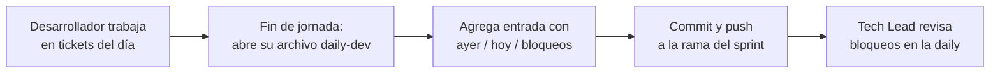

# Instructivo: Reporte Diario para Desarrolladores

**Propósito:** Este instructivo explica cómo y por qué los desarrolladores deben reportar su avance diario. Cada reporte queda como registro permanente en el repositorio para trazabilidad, rendición de cuentas y detección temprana de bloqueos.

---

## 1. Formato

Cada desarrollador tiene **un archivo por sprint** en `Seguimiento/sprint-N/reportes/daily-dev-[nombre].md`. Cada día laboral se agrega una entrada **al inicio** del archivo con el siguiente formato:

```markdown
### YYYY-MM-DD
- **Ayer completé:** [Ticket o tarea. Ej: NAP-15 — CRUD de usuarios]
- **Hoy haré:** [Ticket o tarea. Ej: NAP-18 — Endpoint de login]
- **Bloqueos:** [Algo que impida avanzar; "Ninguno" si no hay]
```

**Ejemplo real:**
```markdown
### 2026-06-22
- **Ayer completé:** NAP-15 — CRUD de usuarios (GET, POST, PUT, DELETE)
- **Hoy haré:** NAP-18 — Endpoint de login con JWT
- **Bloqueos:** Esperando definición de campos de la tabla `usuarios` del Backend Lead
```

---

## 2. Cuándo se llena

- **Frecuencia:** Cada día laboral, una entrada por día.
- **Momento ideal:** Al finalizar la jornada (antes de cerrar el IDE), o al inicio del día siguiente si se prefiere.
- **Daily del equipo:** El reporte escrito **no reemplaza** la daily oral; la daily es para coordinación rápida, el reporte escrito es el registro histórico.

---

## 3. Reglas

| Regla | Explicación |
|---|---|
| **Una entrada por día** | Sin excepción. Si no trabajaste ese día, escribe "No laboré" como "Ayer completé". |
| **Enlazar tickets de Jira** | Usa el ID del ticket (NAP-XXX) siempre que sea posible. |
| **Bloqueos honestos** | Si no reportas bloqueos, el equipo asume que avanzas sin impedimentos. |
| **No borrar entradas pasadas** | El archivo es un diario cronológico. Siempre agrega al inicio, nunca edites ni borres días anteriores. |
| **Primera entrada del sprint** | El primer día del sprint, "Ayer completé" queda vacío o dice "Inicio del sprint". |

---

## 4. Flujo de trabajo



---

## 5. ¿Qué pasa si no reporto?

| Consecuencia | Frecuencia |
|---|---|
| El Tech Lead pregunta en la daily | 1 vez |
| Se escala al CEO | 2 veces consecutivas |
| Se registra en retro del sprint | 3+ omisiones |

---

## 6. Ejemplo completo de un archivo daily-dev (sprint 01)

```markdown
# Reporte Diario — Steven Quiñones

**Rol:** Backend Developer / Tech Lead
**Sprint:** Sprint 01

---

## Diario

### 2026-07-04
- **Ayer completé:** NAP-20 — Integración con pasarela ePayco (sandbox)
- **Hoy haré:** NAP-21 — Pruebas unitarias del módulo de pagos
- **Bloqueos:** Ninguno

### 2026-07-03
- **Ayer completé:** NAP-19 — Modelo de datos de pagos y escrow
- **Hoy haré:** NAP-20 — Integración con pasarela ePayco (sandbox)
- **Bloqueos:** Esperando credenciales de API de ePayco del CEO

### 2026-07-02
- **Ayer completé:** NAP-15 — CRUD de usuarios
- **Hoy haré:** NAP-19 — Modelo de datos de pagos y escrow
- **Bloqueos:** Ninguno

### 2026-07-01
- **Ayer completé:** Inicio del sprint
- **Hoy haré:** NAP-15 — CRUD de usuarios
- **Bloqueos:** Ninguno
```

---

## 7. Referencias

| Documento | Relación |
|---|---|
| `Seguimiento/templates/plantilla-reporte-diario.md` | Plantilla base para comenzar |
| `Documentacion_Empresarial/05_Manual_Buenas_Practicas_y_Formatos_Dev.md` | Estándares de código, daily y cierre de tareas |
| `Documentacion_Empresarial/12_Plan_Gestion_Comunicaciones_y_Cambios.md` | Matriz de comunicaciones y DoD |
